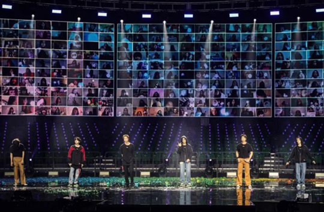

# 元宇宙：品牌不得不面对的“四个转变”

# 元宇宙：品牌不得不面对的“四个转变”

> 编辑导语：元宇宙已经成为不少企业投身的风口之一，许多品牌也试图借用元宇宙打出新玩法，推动品牌的后续传播。不过在这样的营销环境下，品牌应该怎么进行调整，未来品牌又会面对什么样的营销方式转变？一起来看一下。

今年以来，「元宇宙」从未以如此高的频率，出现在大众的视野里。除了技术上的构想和实施，随之而来的还有各大品牌的“元宇宙营销”……

近日，京东上线了 NFT 交易平台「灵稀」，还推出 JOY&DOGA 系列数字藏品作为平台首发藏品，万份数字藏品快速售罄。

腾讯音乐娱乐集团（TME）宣布将正式推出国内首个虚拟音乐嘉年华 TMELAND。

百度于 12 月 27 日发布元宇宙产品「希壤」。

OPPO 在发布第一款折叠屏手机 Find N 时，也发布了全球限量100份的型号词-元宇宙奇旅数字藏品限定礼盒，并请到虚拟偶像-阿喜成为数字推荐官。

双 11 期间，天猫奢品联合六大奢侈品牌 Burberry、Longines、Emporio Armani、Coach、Balmain、La Perla，打造了首个奢侈品「数字藏品」艺术 Gallery。

10月，奥利奥在中国也打造「永不会过期」的NFT数字饼干；麦当劳中国发布首个 NFT 作品「巨无霸魔方」……

之前，时趣研究院也有相关“元宇宙营销”系列文章，供大家学习参考：

- 《一夜涨粉破百万的柳夜熙，竟是来自元宇宙？》
- 《元宇宙营销？超写实数字人AYAYI入职阿里》
- 《NFT营销，品牌已经挡不住了？》
- 《奥迪、LV纷纷试水，万物皆可NFT？》

一方面，我们看到越来越多的品牌逐步进军元宇宙，并出现了一些相对独立的玩法，比如虚拟代言人、NFT产品、社交互动游戏和虚拟演出等；且越来越多的用户，对于元宇宙的参与越来越积极。

而另一方面，目前来看，国内的“元宇宙营销”还停留在“雷声大，雨点小”的阶段，入场的品牌越来越多，但很多营销玩法还不成体系，品牌并未长期投入，仍停留在造势阶段，用户也缺少持续的关注。

元宇宙是去中心化的，被认为是一个新的营销生态系统。这给很多品牌带来了难题，品牌需要比在数字营销时代更努力更积极主动地创造品牌自身的虚拟未来。

**那么，品牌将如何进入元宇宙？营销人准备如何在虚拟环境中发挥品牌作用和塑造品牌？在一个永远在线，生生不息且主要由用户生成内容的虚拟世界中，品牌应该如何表现和传播？结合参考资料，时有趣认为，品牌不得不面对以下四个”转变“。**

## 一、从叙述故事，到创造故事

以往的品牌营销，大都是以品牌为出口的叙述故事，引导消费者产生认可或共情。然而，元宇宙营销将在很大程度上由创作者驱动，并提供各种各样的内容和体验。

以全球最大的多人在线创作游戏平台-Roblox为例。Roblox 是首个定位“工具+社区”的游戏 UGC 平台，为创作者提供技术工具以自由生产内容，为玩家提供平台以进行游戏与社交活动，截至 21Q3 已吸引 4730 万 DAU。

Roblox的用户们使用自己独特的虚拟形象，在UGC的数字场景中和朋友们进行拟真互动，也将线下的社交活动数字化，比如钓鱼、赛车、逛Gucci、看视频、探险等。越多开发者创造游戏和玩法内容，玩家沉浸时间越长，通过社交网络吸引越多的新用户；而玩家基础扩张的同时，由于UGC的激励+反馈经济系统，越多玩家变成开发者，形成正向飞轮效应。

元宇宙营销，用户既是开发者，也是玩家。两者之间的界限如何被打破，形成正向飞轮效应，对于品牌来说，就需要重新审视自己的定位，从故事的叙述者，到故事的联合创造者，让品牌故事能够源源不断地发展下去。比如品牌在一些虚拟社区中购买土地、建造社区，但社区里的故事则是由玩家互动产生。

## 二、从活动直播，到虚拟演出

Lindsey McInerney 全球技术与创新主管Anheuser-Busch InBev曾表示，“未来的体育、媒体和娱乐是虚拟的。有差不多25 亿人已经参与到虚拟经济中。这就是世界进化的方向。毫无疑问，和在现实世界中一样，品牌需要在虚拟的平行世界中找到立足之地。”

一直以来，品牌主们都会通过赞助现场演等方式触达消费者，运动品牌通过赞助体育赛事扩大品牌影响力，啤酒和软饮公司通过赞助买断活动现场的饮料提供权，银行和信用卡公司则利用门票预售权来推广自己……

而元宇宙的出现，让很多品牌的活动赞助有了更多新机会。NFT正在改变品牌和IP所有者与消费者的互动方式。这些Token（代币）在品牌、IP所有者和消费者之间提供了一种直接的关系，可以作为已经获得的真实或数字权益的“护照/通行证。比如，某品牌专有的NFT的所有者，通过身份验证，可以参与下一次的虚拟新品的发布活动。

再比如，防弹少年团 BTS 将增强现实技术集成到直播和虚拟相混合的演唱会中，同时向100万付费用户播出，创造了4300万美元的收入。在直播中整合的AR技术，把粉丝们坐在家中就能安全地挥舞的真实荧光棒的颜色，和直播中的音乐进行同步协调。

而本次虚拟演出的赞助品牌，可以通过自己的产品包装，向全球所有的消费者，提供在元宇宙中举办的BTS演唱会访问权。消费者根据自己所拥有的品牌NTF资产，还可以在这个虚拟演唱会中解锁其他的权益。

## 三、从模特/代言人，到虚拟偶像/数字人

毫无疑问，虚拟偶像，正在进一步丰富品牌营销的方式。以虚拟形象代言来说，它的优势就显而易见。

首先，更节约成本，品牌无须对支付高额的酬劳；其次，不必承担代言人的舆论风险。同时，品牌对虚拟代言人的形象设定、言行举止等是完全可控的，并通过不同的传播内容去丰满人物性格，使之与品牌相匹配。最后，虚拟代言人一旦设定，他将作为品牌的唯一、长期、稳定的形象代表，可以陪伴品牌共同成长。

但对于品牌来说，“养成”一个虚拟偶像并非容易，依靠的是持续不断的文化输出和个性一致。国外虚拟偶像Lil Miquela在社交网站上十分出众，会分享自己的穿搭、美食、社交，表情动作多变，像年轻人一样。

这些创作内容都是根据受众的喜好调整出来的，有利于形象向不同领域应用和场景延伸。要知道面对市场上的同质化现象，只靠外形，虚拟偶像终将面对审美疲劳。

整体而言，虚拟偶像行业长久看是乐观的，但也是竞争非常激烈的红海。品牌借势虚拟偶像本质上是追热点，如何将更为先进的技术恰当地结合到营销动作中，并进行流量转化才是持续新鲜的关键。

## 四、从面向消费者，到面向数字替身

**与其他用户在同一个世界中共享虚拟场景，在虚拟世界中能有真实的存在感，这种虚拟+真实的社交性是元宇宙的一个关键要素。**

以虚拟形象APP起家的Zepeto为例。Zepeto诞生于2018年，为韩国头部互联网企业Naver推出的虚拟形象APP，用户可根据个人喜好打造虚拟形象并购买虚拟服饰进行装扮。在完成虚拟形象DIY以后，用户可选择背景、姿势进行“拍照”，Zepeto提供的“合影”与分享功能使其在熟人社交圈中快速扩散。

从2019年的2.6版本开始，Zepeto添加“主题乐园”功能以拓宽陌生人社交场景，此后“主题乐园”地图不断扩充以形成如今的“世界”栏目，为促进内容生产，Zepeto于2020年推出Zepeto Studio以激励用户创作虚拟商品与地图。**而社交场景的拓宽使Zepeto进化为虚拟经营世界，全球用户规模已突破2亿。**

**庞大的年轻用户规模与较强的时尚感使Zepeto成为品牌营销新阵地。**自初代版本以来，时尚装扮一直是Zepeto的重要元素，该应用亦因此吸引了大量年轻女性用户，根据Naver Z最新披露数据，所有用户中70%为年龄介于13-24岁之间的女性。由于用户画像与众多时尚品牌的目标客群高度重合，Zepeto吸引了超过60个知名品牌与IP，成为品牌营销、IP宣传的全新阵地。

元宇宙营销，很重要的一个转变就是，品牌要面对的不再是现实中的消费者这么简单，而是消费者及其数字替身，它具有社会人的属性，也具有虚拟交互需求。

“虽然元宇宙表现为一系列实时且最终相互关联的在线体验，但它其实是由一些早就被前沿品牌和营销人员们所熟知的变革性趋势赋能和定性的，其中就包括共享社交空间、数字支付和游戏化等等。然而，元宇宙的未来则将呈现出大多数消费品牌都非常陌生的绝对进化，其中最值得注意的就是是区块链技术、加密货币、数字商品、非同质化代币 (NFT) 和个人数字替身(Avartars)。”（《THE METAVERSE IS THE MEDIUM 》）

当然目前来看，元宇宙营销还有很长的路要走。
