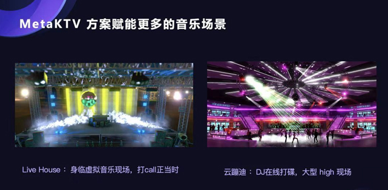

# 元宇宙不缺创意，缺的是「基建」公司

# 元宇宙不缺创意，缺的是「基建」公司

科幻小说《雪崩》是无比超前的。它出版的 1992 年，英特尔还在制造 486 系列处理器，直到次年，586 奔腾处理器才被推出。

在小说中，尼尔·斯蒂芬森创造了一个并非以往想象中的互联网——元宇宙（Metaverse），在这个与现实世界紧密联系但又相互平行的时空里，人们可以借由各自的「化身」在其中交流和娱乐。

Facebook 改名 Meta 后，越来越多的人才知道，原来这本科幻小说是「元宇宙」这个词的起点。一瞬间，一个书里并没有准确定义的概念，30 年后开始成为了商业世界里火爆的新边疆。

只不过，在目前看起来比较接近「元宇宙」的 VR 行业里，即使设备销量逐渐攀升，但分辨率低、设备笨重、3D 眩晕等问题还未完全解决。元宇宙看起来是个性感，但还有着众多技术问题无法解决，还非常遥远的概念。

「从 Utility（效用）到 Reality（现实），我认为元宇宙是有发展路径的，并且早晚会进化到改变我们现实世界的程度。」王奇所供职的公司声网，最近就开启了「元娱乐」的新探索，他成为了这条业务线的负责人。

这次他们在实践中，对于元宇宙下一步在技术上应该去解决什么这个问题，有了新的思考。

**01、「元娱乐」里，声音技术是关键的下一步**

「现在所谓的那些元宇宙的应用，离还原人类的真实体验还差得特别特别远。」

根据 Sensor Tower 2022 年的报告，自「元宇宙」概念爆发以来，平均每天都会新增一个「元宇宙」软件，其中，元宇宙社交类软件更是层出不穷。在一个个炫酷的 demo 里，我们似乎离再建一个虚拟现实很近了，但王奇并不这么认为。

2020 年 4 月，《堡垒之夜》里举办的「ASTRONOMICAL」虚拟演唱会吸引了 1230 万观众，玩家在霓虹灯束散射中舞动，很多玩家表示仿佛经历了一场真实的梦境。绚丽的布景渲染了人们对技术的最高想象，然而实际上，观众只是在「看」一场演唱会。算力等客观因素限制下，多人同屏和物理交互往往就如鱼与熊掌，玩家在一个「众人场」里能得到的交互体验其实很低。

*《堡垒之夜》中的「ASTRONOMICAL」虚拟演唱会*

「我们的元娱乐其实并不等同于元宇宙娱乐」，声网元娱乐业务线负责人王奇在接受采访时说，「我们更接近下一代的娱乐这个概念。」在他看来，现有的技术和体验还不能满足人类超越现实的需求，首先要思考的或许是如何去还原一个真实的世界。

5 月 16 号，声网发布了「元娱乐」四大解决方案，其中，他们对音频的处理十分惹眼。

在发布会上，声网元语聊产品经理杨帆展示了一个多人会议的场景：代表每个参与者的头像分布在不同区域，**而从其他人说话的声音信息中，能体会到明显的方位感。**

**这项技术被称作 3D 空间音频**，贯穿在他们的元语聊、元 K 歌、元直播等方案里。

当用户操作 Avatar 在虚拟场景里移动时，听到的音效会根据 Avatar 的头部及脸部朝向、声源角度和距离不同而变化。比如，在玩家进入一个元语聊的房间时，会听到房间内正在播放的背景音乐，随着位置的移动、墙壁或卡座等障碍物的遮挡，玩家所听到的声音也会相应地逐渐清晰或减弱。

这项功能的实现，依赖于声网基于 HRTF 相关传递函数、心理感知声学、声源指向模拟等算法自研的一整套 3D 声场渲染引擎。通过这套渲染引擎，可以动态模拟空间中任意角度、朝向的声音在传递到左右耳时声音发生的变化。他们还可以通过声学建模的方式，模拟任意角度的音源方向导致的音色差异。

*声网的空间音频技术*

「这其实在业内还没有几家能够做到」，王奇谈到这些技术时颇为自豪。据他介绍，声网内部有一个音视频实验室，专门研究各种跟音频和视频相关的算法，其中就包括 3D 空间音频，此外还有人声模糊、模拟现实中空气衰减等技术。

在这些声音技术的加持下，玩家操作 Avatar 不仅可以「移步换景」，还可以「移步换声」，可以移动到其他玩家身边开启畅聊，也能凭借人声模糊技术既不受周围人说话声音的干扰，又保留环境氛围，在技术上极力还原现实世界中的真实听觉体验。

模拟现实其实十分困难的，因为对于一个玩家来说，一些很细微的「不合常理」都可能影响沉浸感。那些「不合理」会时时刻刻提醒玩家，这不是一个真实的世界。因此**对于营造一个「栩栩如生」的虚拟世界来说，要不断地打磨环境，细化交互的颗粒度。**

当然，这对技术实现来说并不容易。

除了声音的拟真外，声网解决方案中同样有对虚拟环境的拟真。在元语聊和元直播中，声网还基于 3D 引擎建模创建各种场景，能模拟碰撞、重力等物理效果。面部动捕技术、语音驱动嘴型的技术，则让玩家与 Avatar 的表情匹配，实时表情与语音匹配。

而为了让玩家在选择虚拟形象时不受性别限制，他们还将开发声纹变声技术，在声音上实现「any to any」的模拟。萌妹子选择大叔形象后，也能在实时交流中拥有与虚拟形象匹配的低沉男音。

影响沉浸感的一大因素还在同步性与低延迟，就像《堡垒之夜》的那场虚拟演唱会，如果没有上千万人的同步参与，或许也不会如此轰动。

在那场盛大的虚拟演唱会中，玩家也被分到了上万个服务器上，才让千万量级的同步参与得以实现。而在实时通信和互动上，声网作为 RTC 领域全球头部企业，有着行业领先的技术优势。

*声网的 MetaKTV 方案*

声网的 SD-RTN，是全球规模最大的软件定义实时网，官网上介绍，这项技术可以实现百万人大频道的实时互动。依靠基于 SD-RTN的解决方案架构，声网打开了万人云蹦迪、在线上造一个超级夜店的想象。

它的合作伙伴 XRSPACE，也在近期推出了全球首款音乐元宇宙 PartyOn。利用声网的实时音视频技术和 XRSPACE 自研的表演同步技术，PartyOn 实现了 50ms 以下的同步误差，不仅让让众多玩家享受低延迟的同步 K 歌，还让人声、歌曲和 Avatar 肢体表演实时匹配。

这些「拟真」的技术赋能了更沉浸的体验，王奇说，「3D 空间音频，包括声纹变声、面部捕捉还原，所有的这些技术，它本身都是跟元宇宙的发展相关的」，「我们本身也是看好元宇宙发展的」。

**02、通过提升可用性，声网在瞄准下一代的娱乐生态**

陈际陶是声网元直播的产品经理，她在发布会上展示的实时面捕功能，可以在直播中同步玩家单边眨眼、挑眉、眼球转动、吐舌头等动作。

这项技术似乎已经在各种 AR 换脸软件中得到了很好的应用，但对他们来说其实并不容易。她介绍说，「我们要解决移动端的普通单目摄像头的问题，要解决光源的影响，光亮的阴暗对于人脸关键点判别的难题，以及说眼镜遮挡对于眼部的识别的问题。」

这也引出了声网技术解决方案的另一个特点——强兼容性。

作为一家技术服务提供商，声网并不是产品的最终「缔造者」，他们的责任在于对接每个场景内尽可能多的客户，提供底层和通用的技术，让客户能在他们提供的技术服务基础上创造价值。某种意义上来说，他们的最终目标在于客户的使用便利与商业成功。

「大家用过苹果应该都知道，如果在不使用 iPhone 的情况下使用 Airpods，很多体验其实你是用不了的。」杨帆在介绍空间音频技术时，同样提到了声网技术服务的独特性，「我们的跟他们的区别在于，苹果是传感器硬件加上软件算法，我们是纯软件的，安卓端、iOS 端、 PC 端，多平台都能支持。」

这在他们的「互动游戏」解决方案中也有体现。声网为它的技术集成方案适配 3 万多个移动终端，几乎覆盖所有中低端机型。昌潇潇是声网互动游戏的产品经理，他补充说，「像在海外，特别是在一些落后的地区，市场上一般情况下都是千元机，我们在中低端机型的适配这一块儿是非常看重的。」

声网对元娱乐业务的探索同样是在做适配。

声网创始人赵斌曾说，**「实时音视频是一种通用能力，作为服务商，需要持续推动能力与具体场景的碰撞与融合」**。实际上，声网开展元娱乐业务并非没有依据。

声网连续多年蝉联全球实时互动解决方案市场份额第一，全球注册应用超过 40.5 万，活跃客户数量达到 2670 家。在这些客户中，很大一部分来自于社交娱乐领域，比如一些国民级别的在线 K 歌应用。

这些客户原本只是采购了实时音视频服务，但在跟客户的沟通中，声网团队发现了这些客户的普遍痛点：没有时间和精力投入研发；一个平台单独去谈音乐版权合作时门槛太高，都要千万打底。

去年 9 月，声网推出了一个叫「K 歌房」的解决方案，由声网提供 K 歌互动场景的研发，集中解决音乐版权的问题。

解决方案的发布象征着声网业务模式上的进阶。这意味着声网在 RTC 技术服务商的基础上，尝试叠加基于场景的通用技术服务、整合生态内的其他内容，最终打包成一个整体的解决方案。

这项业务很快验证了新模式的可能性，短短几个月里，「K 歌房」发展了几十个客户。在他们看来，声网提供解决方案的尝试提高了行业的效率，同样的逻辑在泛娱乐领域同样如此。

「这些社交娱乐的客户，他们的音视频服务其实之前就已经用声网的了」，王奇说，「在此基础上，如果我们去做一些场景跟内容的叠加，其实会非常方便」。

如果说声网之前提供的 RTC 技术服务是卖面粉，王奇将提供元娱乐解决方案比喻成对面粉的二次加工，「当我们开始关心到他（客户）其实是做饺子馆的时候，我们会把面粉做成一摞一摞的饺子皮，然后去整合了一些优质的牛肉跟猪肉剁成饺子馅。」

声网元娱乐发布会后，Cocos CTO 林顺参与了圆桌讨论，在他看来社交类应用主要聚焦在特定场景，相较于其他领域确实更易与元宇宙概念结合。

现实却是如此，2021 年燃起的「元宇宙」之火，还在以一种更容易落地的「+泛娱乐」的方式延续。

去年，VR 社交平台 Rec Room 融资了 1 亿美元，VRChat 也完成了 8000 万美元的 D 轮融资，Snapchat 收购 6 家 AR 相关底层软件算法和硬件企业。3D Avatars 公司 Genies 近期宣布获得了 1.5 亿美元的 C 轮投资，用以扩展 Metaverse Avatars 的开发。国内网易、腾讯、字节等大厂的元宇宙社交平台，也在 2021 年底和 2022 年初纷纷上线。

声网的很多客户也都是元宇宙领域的种子选手，比如中东及北非地区最大的语音社交娱乐平台 Yalla、火遍北美与拉美的元宇宙社交软件 Oasis。声网还发起了「声选计划」，项目聚焦 RTE 赛道下的技术型合作方，协作推出更丰富和更优质的联合产品解决方案。

这家实时互动领域的技术领头羊在元娱乐业务上的动作，是要为共建一个面向「元宇宙」的、下一代的娱乐生态做准备了。
