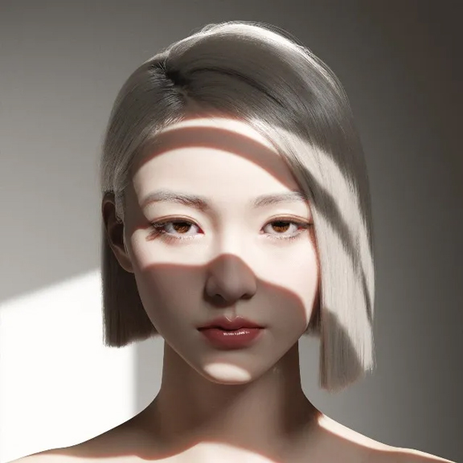

# 元宇宙创意营销案例盘点

# 元宇宙创意营销案例盘点

> 在一些人还在质疑“元宇宙”是不是造概念时，官方已经表现出对数字经济的热衷态度。

2022年开年，武汉、合肥、上海市徐汇区均将元宇宙写入今年政府工作报告。此前，浙江、无锡等省市也在相关产业规划中明确了元宇宙领域的发展方向。加强底层核心技术的前瞻研发、推动元宇宙技术在多领域深度应用等成为重点。

业内人士认为，对于推动元宇宙技术发展，北京、深圳、广州、杭州等城市均有可能跟进，预计未来政策支持方向主要集中于虚拟现实产业融合和底层支撑技术领域。

另一方面，在民间，2021作为“元宇宙”元年，各行各业都在对概念落地应用进行探索讨论。元宇宙诞生已久，但走红还是从去年年底开始。而元宇宙这股风也是迅速席卷大小企业，让企业成为其忠实拥趸。

各大互联网企业的相关动作数不胜数。据企查查数据显示，截至2021年底，中国境内共申请“元宇宙”商标达11376件，涉及公司达1692家。其中2021年申请了11374件，涉及公司1691家。也就是说，99.9%的“元宇宙”商标均于2021年注册申请，2021年被称为元宇宙商标申请注册的元年也不为过。

这其中，有的小步快跑，有的企业是大步流星，这都证明了企业们对元宇宙抱有极大热情。热情的背后意味着元宇宙的第一站将是“营销场”吗？

回头来看，企业之所以对元宇宙抱有极大热情，是因为要发掘出元宇宙的营销价值。例如携程董事局主席梁建章说“作为旅游者，应该把更加高级、更加有趣、更加复杂、更具逻辑性宇宙的高级趣味充分地展现出来，我们要把旅游做得更加有交互性，更有沉浸感，更有趣，要把体验做得远远比元宇宙好”。

事实上，很多企业永远是先于个人，率先看到元宇宙背后的很多价值，营销价值就是其一，也是最先显现出来的。营销因其自身的特殊性，总是先于产品一步，在产品诞生之前，就不断向用户介绍相关概念，这是一个用市场进行教育的过程。

那2022年，有哪些值得细细分析的营销案例呢，今天，小编从创意、效果等方面盘点出5大案例，供各位看官参考。

​      **1.天猫“你好元宇宙”**

AYAYI是天猫合作打造的国内首个Metahuman（超写实数字人）。她在去年5月横空出世，成为众多国际大牌青睐的“优质偶像”。9月8日，她正式成为阿里的数字人员工。去年 5 月，AYAYI 亮相小红书，首发帖阅读量近 300 万，一夜涨粉近 4 万，并吸引到娇兰与其合作，其是一个高颜值，高流量的KOL。

去年中秋前夕AYAYI入职阿里，成为天猫超级品牌日的数字主理人，与天猫超级品牌日联手发布了 NFT 月饼。

总的来说，NFT潮流发展与阿里巴巴的技术条件，促成了天猫第一个数字月饼的诞生。

​                                                                   

​     **2.一夜爆火柳夜熙**

“柳夜熙”在元宇宙+虚拟偶像+美妆的加持下，交叉上演赛博朋克和古风奇幻的场景，凭借一条视频便火出了圈。

她自称是一位会捉妖的虚拟美妆达人，第一条视频发布于2021年10月31日，名为“现在，我看到的世界，你也能看到了”。视频还加上“虚拟偶像”、“元宇宙”、“美妆”的话题标签。与此同时，话题“挑战柳夜熙仿妆”已有2.4亿次的播放量。

“柳夜熙”踩中了迅速蹿红的“元宇宙”概念，以虚拟偶像形象填补了元宇宙的想象空白，“启蒙”了大众的元宇宙世界观。

柳夜熙之所以爆红，是有空前的突破：首先，柳夜熙是一个彻底的国风虚拟人，她身上的国风元素绝不只是装饰，而是进入骨髓之中，这也正是其短片极大受欢迎的文化心理底层原因，毕竟大多数国人的审美爱好，仍然是很东方传统的。

其次，这是第一条有故事的、真正让高仿真虚拟人活过来的短片，既有丰富细腻的表情、又有强故事性和世界观设计。柳夜熙打破了国产虚拟人的天花板，一举将虚拟人带入到故事宇宙当中，而不再只是纸片人的唱歌跳舞。这也让人们看到了更大的内容宇宙可能，和后续的内容潜力。

​                                                       

   **3.天猫双11首届元宇宙艺术展**

2021年双十一，天猫超级品牌日就率先联合超写实数字人AYAYI，打造了一波天猫双11数字藏馆的元宇宙新玩法，以虚拟偶像+数字化新品牌货品的新潮形式，集结百⼤超级品牌率先亮相！活动中，天猫以阿里巴巴虚拟人AYAYI，举办了首届元宇宙艺术展，联合burberry、自然堂、小鹏汽车、五粮液等品牌发布了8款限量数字藏品。

这种线上变现方式，成为了众多超级品牌在这个双十一的发力点。头部品牌与天猫联合设计出了品牌独有的数字藏品，让原本存在于小众圈子里的NFT概念以更直观的方式走入了普通消费者的生活。

一边是各种王炸商品的诱人折扣，一边是“数字藏品”在一个概念化的艺术馆中接连亮相，超级品牌开启了全新的品牌价值探索。而对于电商平台来说，十几年来售卖了无数实体商品之后，上架数字藏品的新商业时代，或许就要到来了。

元宇宙的风口或许还没来，但元宇宙营销的时代正在悄悄降临。而天猫超品明显就是这个场域中的“头号玩家”。

   **4.美的2022 Dr.M系列**

2022年跨年第一天，美的官方发布了“美的2022 Dr.M系列”，以美的IP“M博”为基础创作的数字藏品，限定1000份赠送给用户。

在M博的故事设定中，M博是“美的星球”的科技极客，他经常遨游在宇宙之间，热衷破解宇宙的科技难题，因此角色的服装还原的是一组具有未来感的白衣盔甲，再搭配出浓眉大眼以及短发的造型，塑造出M博精神爽朗的角色感受；

在元宇宙这个概念下，除了品牌IP，美的集团在工业互联网方面也有所布局。

在过去，人们对于工业的想象可能更多是出现在都市新闻里 “人满为患” 的组装厂，但随着工业 4.0 时代的到来，信息化和智能化技术的普及，现代工厂会出现越来越多像《变形金刚》一样酷炫的机械化设备。

在美的集团的“5G 智慧工厂”中，就广泛应用了 5G 融合定位、AGV 无人驾驶、AI 视觉等前沿技术，配备了 AR 技术的工厂，还能让工程师足不出户就能精准找出机器故障，实现远程指导维修，实现工业互联网智能制造新模式。

利用 “数字孪生” 打造的虚拟 3D 工作台可以在虚拟空间中创建一个现实模型，不仅能将现实世界 1:1 复制进虚拟世界，还能实现与现实同步运转，无限接近真实。而这些，大概就是工业元宇宙（Industrial Metaverse）的雏形。

 **5.老虚拟艺术家“哈酱”首次破圈**

2021年9月29日，全球三大音乐版权巨头之一，华纳音乐签约首位虚拟艺术家，拥有一头标志性蓝发的哈酱携单曲“MISS WHO”出道，在娱乐领域的发展走在了前列。这次，作为首支个人单曲，哈酱的这首“MISS WHO”结合了电子风与国风元素，还加入了部分的昆曲，人声部分采用了微软首个AI语音定制技术 (Microsoft Azure Text-to-Speech Technology)进行创作，拥有独特的科技创造性。目前，哈酱在个人社交账号上的粉丝数已经超过10万——自2019年诞生以来，虚拟艺术人首次强势破圈。

事实上，与单纯二次元虚拟偶像不同的是，我国超写实虚拟偶像行业仍然处于早期，入局玩家较少，行业发展前景极为宽阔。而哈酱作为其中较早入局的一批玩家，且现在已经拥有了丰富的作品，以及通过参加各类活动所探索出的多元的商业模式以及成熟商业生态。得益于此，哈酱自身已经在行业中拥有了足够的优势，能让她更快地建立起自己的壁垒，达到更早破圈的目的。

近年来，国潮风兴起，而哈酱早已进军国潮领域。如今，哈酱已经与uooyaa，GQ，LPL，哈尔滨啤酒，李宁，摩登天空等达成过深度合作，在国潮服饰、电玩、街潮音乐都有所涉猎，这些都为哈酱之后的多样化商业化开发打下了基础。

元宇宙是一个平行于现实世界，又独立于现实世界的虚拟空间。简言之，它为人类社会实现最终的数字化转型提供了新路径，其划时代的历史意义不亚于此前的大航海时代、工业革命时代、宇航时代等等。

作为人类文明进入下一纪元的宏大叙事体系，元宇宙从本质上将把我们从互联网 2.0 时代（通过社交网络将人和人链接）带入到互联网 3.0 时代，让人、空间和事物能够更加无缝隙、无痕迹的相互连接，让虚拟和现实之间的界限真正消失。

以 “元宇宙” 为代表的技术正在激发各行各业的内部革新和创意爆发，有望颠覆现有的商业格局，催生崭新的生产模式，孕育新的万亿级生态蓝图。

知名市场研究机构IDC发布了《2022年中国元宇宙市场十大预测》报告。报告对于2022年中国元宇宙市场做出预测，包括互联网大厂各自独立布局元宇宙平台、培训和远程办公有望成为最先落地的元宇宙商用场景等。

前方的路或许还是星辰大海，技术的发展还很遥远，但当巨头、资本、媒体纷纷涌入，基于元宇宙的虚拟营销，正从试验边缘走向聚光灯。

作为一个持续输出先锋企划的内容厂牌，天猫超级品牌日在“元宇宙”世界里的各种玩法体现了其源源不断的创新能力，更是传递出持续布局虚拟营销赛道、通过科技赋予的全新玩法与创新增加用户留存，抓住未来最有消费意愿和消费能力的目标人群这一野心。

作为虚拟营销赛道的“头号玩家”，天猫超级品牌日正站在聚光灯下。
