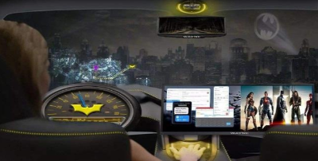

# 游戏主导未来？元宇宙开发前沿

在传统的视觉电影中，从开始到结束需要几个星期甚至几个月。而《曼达洛人》则是利用游戏引擎，将“虚拟制片”的新一代电影制作出来。在拍摄的时候，制作团队在 LED屏幕上布置了一个圆形的 LED屏幕，将场景的效果和最后的效果完美结合，让演员们可以告别绿色的幕布，不需要面对空气，也可以根据导演的要求，随时调整场景的远近、光线、气氛。

《曼达罗人》是由虚拟引擎5制作的《曼达洛人》第一季的前半部分采用了这种虚拟制片流程，这样就可以避免制作人员在外景地进行拍摄，也可以实现大量复杂的特效“所见即所得”，消除了长久以来后期抠像和渲染中存在的巨大不确定性。

游戏引擎的高真实感和即时呈现，使影片制作公司在创意上有了前所未有的弹性，同时也大大减少了创意的花费。这仅仅是一个小插曲，改变了这个世界。

“游戏，仅仅是一场游戏？”

但现在，游戏技术已经发展到了一个相当成熟的程度，在技术上占据了绝对的优势，并逐渐“溢出”到了教育、科研、工业制造等各个方面，为人类探索宇宙开辟了新的道路。

聂海胜，刘伯明，汤洪波，三名宇航员，在天和的地平线上工作。与他们一同来到空间站的，是一位数码记者，名叫“小诤”。

腾讯与新华社联合推出世界第一个数码宇航员小诤

“小诤”是世界上首个数字宇航员，可以“现场报道”载人航天、行星探测、月球探测等国家重要的航天工程。这一切都要归功于腾讯游戏 NExT Studios提供的数字人技术，由15名工程师完成，历时3个月。十万根头发，143根骨头，5000多种不同的微表情，让“小诤”拥有了与真人无异的相似度，能够完成真实世界中无法完成的工作。

影视、航天报道不是什么稀奇的事情，因为游戏已经影响到了科技的发展，也改变了人类的生活。

资讯时代的石油与棉花

虽然不是所有的游戏机和游戏都能带来巨大的变化，但是，资讯革命的发展和游戏历史息息相关。

“0x5f3759df”这句话在常人看来就像是一串乱七八糟的代码，但约翰卡·马克却从未想过，这个数字不但让他成为了《雷神之锤》系列游戏的创造者，也让3D游戏引擎的创始人，也改变了整个技术行业。

《雷神之锤》的推出，标志着 FPS游戏全面进入了3D时代，同时，3D游戏的需求也随之增加， PC机的硬件也随之增长。NVIDIA也因此发布了 GeForce系列的图形卡，并且在游戏的屏幕上不断地增加它的浮点计算能力，使得它成为了 AI发展的重要力量。英伟达在“AI运算芯片”领域的研发上，也取得了巨大的成就，成为了世界上最大的芯片制造商。而在不知不觉中，游戏已经成为了技术创新的一个关键因素。

**在 VR领域，游戏和显卡的发展一样，都是对虚拟现实技术的支持。** 

《半衰期-爱莉克斯》的推出，让 VR游戏的画面、互动成为了一个标准，也让玩家们更加坚定了购买 VR游戏的决心。从数据上来看，这款游戏在三天内的销量已经突破了四十万，到了2021年，已经有六十多款 VR游戏进入了百万美金的市场。而“破冰”的效果，也会促进 VR产品的量产，从而降低 VR产品的制造成本，优化产业链，促进虚拟现实行业的快速发展。

《半衰期-爱莉克斯》是 VR游戏的制作者，也是游戏交互的典范。

就如同一次工业革命，最初是人类对衣物的需求，而“棉花”则是带动了纺织与蒸汽技术的发展，而“石油”则在二次工业革命中发挥着重要作用，两者都在推动着整个产业链的技术变革，并最终改变了整个世界。

在最近几十年里，游戏就像“石油”、“棉花”一样，是电脑和资讯科技的发展。随着玩家数量的不断增加，不仅将个人电脑、图形界面、互联网等新技术与大众之间的距离缩短，同时也为软件、硬件、通讯等领域带来了巨大的市场需求，为未来数字社会的发展奠定了坚实的基础。

更有甚者，社会的发展，甚至是国家实力的比拼，都离不开科技，而这当中，有市场的规模和活力，也有智慧和创意。在后者中，游戏依然占据着重要的位置。我们今天对这个游戏的许多探索，都会对塑料技术的未来有所帮助。

**最前沿技术的最佳实验方案** 

不久前，在广州召开的“2021中国游戏行业大会”上，腾讯公司的副董事长张巍表示，“游戏”是科技创新的重要推进器，也是高科技企业的“先导”。

**中国电子竞技行业年会暨科技共生论坛于广州召开** 

在过去的十多年中，世界各国的科研人员一直将博弈与对抗作为人工智能研究的基础。谷歌 DeepMind团队，首次以“智能仿真技术”为切入点，并凭借其在 AI方面的积累，成功地开发出了一个名叫 AlphaGo的围棋 AI。同时，在《王者荣耀》的基础上，腾讯开发出了人工智能“绝悟”，成为了职业选手。

最近，全球500位程序员参加了一场“找钻石”比赛，这是内基·梅隆大学、微软、 DeepMind、 OpenAI以及 NeurIPS联合主办的 MineRL大赛（MineRL Competition)，已经是第三届了。

在「科技共生」论坛上，谢宁博士指出，「游戏是一种即时互动的闭环环境。所以，业内也相信，下一个 AI的里程碑，将会在游戏中诞生。

简而言之，如果 AI在游戏中，可以实时感知、分析、推理、判断、行动，那么它的应用范围就会越来越广，例如智能交通、电力调度、物流调度等，一旦应用到实际的应用中，将会给我们的生活带来极大的变化。

而游戏作为虚拟技术的载体，既是对人工智能进行实验的沙箱，又是一种“新的产业软件”，促进了数与现实的融合。

就拿无人驾驶来说，一直以来都是研究者们所面临的一个问题，那就是缺少充足的试验环境。从时间上来说，业界普遍同意，要想确保无人机的安全，至少要收集177亿公里的试验数据，这可能要在全国各地跑3400次以上。从环境上讲，常规公路的检测费用较高，对突发事件的检测机会也较少，同时也存在着一些安全风险。

游戏引擎的虚拟模拟功能，就是最有效的解决方案。以腾讯自主研发的汽车模拟模拟系统 TAD Sim为例，利用自主研发的游戏引擎技术，在高分辨率的画面渲染的基础上，构建出一种高度模拟的虚拟现实，可以24小时不停地进行大量的模拟试验，并且可以模拟暴雨、大雾、下雪等极端恶劣的天气，甚至还能根据太阳的高度、雾的浓度、雨滴的大小，进行实时的模拟。

**腾讯汽车驾驶仿真系统 TAD Sim** 

利用游戏技术进行仿真，可以极大地减少自主驾驶研究的费用。不止是国内，就连世界上最大的汽车制造商，也都将目光投向了游戏引擎。谷歌的无人驾驶汽车 Waymo是业内公认的技术领头羊，它在实际中仅进行了0.2百万英里的路面试验，而在虚拟环境中，它的模拟试验却达到了一百五十亿英里。

另外，由于游戏引擎在三维建模、物理特性、动作等方面的长期积累，使得它可以以1:1的价格，在城市和物理世界中构建出一堆数字孪生，从而在航天、智能制造等领域得到了广泛的应用。

现在的游戏，早已不是单纯的游戏了。或许，就像张巍说的那样，随着技术的发展，这款游戏将会变成一种更加灵活、高效、友好的“超级数码场景”。
