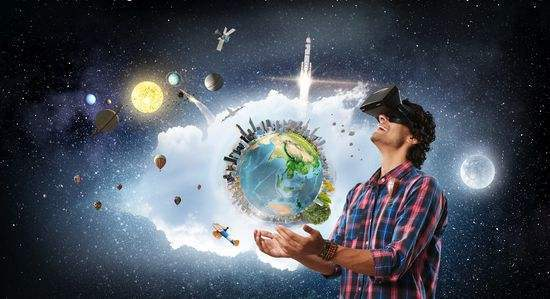

# 元宇宙，游戏，未来？

什么是元宇宙？元宇宙（Metaverse）一词由前缀“meta”（意为超越、元）和词根“verse”（源于 universe，宇宙）组成。

「元宇宙」的内涵是吸纳了信息革命（5G/6G)、互联网革命（web3.0）、人工智能革命，以及 VR、AR、MR，特别是游戏引擎在内的虚拟现实技术革命的成果，向人类展现出构建与传统物理世界平行的全息数字世界的可能性；引发了信息科学、量子科学，数学和生命科学的互动，改变科学范式；推动了传统的哲学、社会学甚至人文科学体系的突破；囊括了所有的数字技术，包括区块链技术成就；丰富了数字经济转型模式，融合 DeFi、IPFS、NFT 等数字金融成果。

数字资产研究院学术与技术委员会主任朱嘉明教授

#### 游戏和元宇宙有什么关系？

没有关系。

硬要说有关系，也只是大众对游戏的刻板印象带来的——游戏是一个可以互动的，脱离现实的，在线的虚拟世界。当然，目前有一些游戏是有些接近元宇宙的概念的。

比如《我的世界》这样的沙盒游戏，允许玩家对其中内容随意改动并制作成“模组”，通过架设服务器或安装包的形式让别人玩。

在这种模式下，《我的世界》本身是这个宇宙的核心，各种各样的模组视其规模大小，组成了星系、恒星、行星等等。

当然，仅仅这样还不够。元宇宙是包含商业场景的，也就是说这个宇宙是有经济行为的。这也是为什么拿《我的世界》举例的原因，因为模组的制作者只要愿意，可以通过贩卖入场券（账号密码）、游戏中道具，或者引入广告等等形式产生收入。问题来了，这不就是私服模式吗?《我的世界》是有局限性的，至少，它缺少一个能让所有人登录并提供社交空间的大厅——以满足元宇宙的另外一个层面——真人（通过虚拟世界的化身）社交。

*注意，私服中的社交虽然是一方面，但是，一个全局的社交空间和方式是必不可少的。另一方面，你能想象这样一个画面吗？*

来自各个传奇私服的大佬们，穿着奇装异服，一起喊着“是兄弟就来砍我”。也不知是谁先动的手，很快就爆了满地的装备，每一件都有酷炫的特效。

**最后，只剩下2人留在场上，互相砍杀着，血条未见半丝变化······这里我们引出2个问题：** 

私服的随意性会导致全局的不平衡。有关战斗力，也有关其他各种力。这种不平衡进而会导致这个宇宙因为无法沟通而难以存续。最终还是散漫的私服状态。那么，如果需要这么个宇宙，由谁去控制这个宇宙的平衡？

奇装异服，或者说那些能让人在私服中与众不同的东西，在这个或者那个宇宙中也能带来同样意义吗？
元宇宙的平衡由谁来控制？当我们谈到这么宏大的一个问题时，总会忍不住去想——开发者会成为这些宇宙里说一不二的神吗？从我的角度来看，这个问题在当前的概念中是无解的，所谓控制，过程中是不在乎长期存续而只管当下利益的。

有人说，元宇宙就是虚拟世界的乌托邦，一个理想乡。诚然，每个人对乌托邦的理解都是不同的，却有唯一的共性，一种叫做“自由”的东西，即便每个人又对自由有不同的理解。

那么，假设有这种自由，它能用来干什么？打造一件极品装备？练就绝世武功？让我们离开网络游戏的概念去看待。

你可以无视物理距离、种族和性别差异、国家和政治理念，为了一个小众或大众的理念，依靠自己或团体，在这个宇宙中创造一些毫不起眼或与众不同的东西——小到日常闲聊分享见闻，大到破解黎曼猜想，发现抗癌药剂。

**太美妙了不是吗？** 

等等，这不就是互联网吗？是的，元宇宙就是互联网的再包装，并且试图赋予一些新的意义。

说到这里，已经无论是否网络游戏，我们都知道所谓的平衡由谁掌握了——每一个元宇宙，无论它叫我的世界，还是ROBLOX，或者QQ、微信、抖音，它们最终的服务对象都是资本。

因为不平衡所以才会有平衡的需求，一切平衡都是有价的，就看你愿不愿意付出了。所以，相比互联网诞生之初带有一些理想化的东西，元宇宙就是彻底为商业服务的概念了。元宇宙需要云端的硬件基础（toB业务），需要有人去做（就业），需要显示器（toB和toC业务），需要营销和宣传（toB业务，toC业务，就业）。

至于其他，毕竟元宇宙只是个虚无的概念，所有需要被兜售的概念都可以被装进去，比如人工智能，区块链，XR等等，就像文章开头引用的那位教授提到的各种名词那样，明不明白不重要，都得装进去。

**那么，元宇宙的价值核心是什么？** 

只是这么看的话，元宇宙是没有价值核心的，它无非是要把现实和其他虚拟世界中既存的东西经过调整后再放到里面，然后告诉你，这是你的墓地，现在不买以后就只能撒大海了（可能是那个宇宙中的海，也可能是真的海）。这听起来很荒谬，因为大部分人不会认同虚拟世界中的资产。然而，我们需要了解到的是，一些技术和商业上的变化正在缓慢的改变我们对这个世界的认知。比如NFT（Non-fungible Token，非同质化代币）。

**在这个词语中，我认为token更适合翻译成计算机中所谓的令牌。** 

**我们千猴马录制了一段关于游戏设计之道的视频，并发布到了网上，每个人都可以免费观看，你愿意的话，可以帮我们买几杯咖啡。** 

但是，我们觉得咖啡太苦了，想喝点好的。于是又做了一个视频，并把这个视频包装成了限量发行10份的NFT，相当于这个世界上出现了10份有唯一编号且被我们认证和可以追溯的视频。知识付费嘛，有5个人认可我们的设计之道，各自购买了1份。这5个人对视频是有所有权的，他们可以选择公开或者转卖。这时，有意思的事情发生了。

以过去的模式来看，公开也好，转卖也好，已经和我们没有任何关系了。但是从现在，也就是NFT的角度，因为这些视频可以被我们追溯，只要我们愿意，我们可以对每一次播放和转卖收费。这很像传销模式，只要有人接盘，你画的饼是什么根本不重要。

更有意思的就在这里，随着抖音，或者未来什么形态的大众媒体愈发占据人心，越来越多的“空气大饼”会被人们接受。

**这到底是好还是坏呢？** 

回到那句话，因为不平衡所以才会有平衡的需求，一切平衡都是有价的，就看你愿不愿意付出了。当虚拟世界和现实世界之间出现了不平衡，那维持这个平衡的价格，可就不是我们认知范围内的数字了。至于奇装异服，或者宇宙中的一块坟墓，你觉得有意义就好，还管得着别人怎么想吗？
