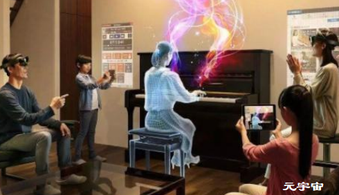

# “元宇宙”时代，虚拟营销正当时

# “元宇宙”时代，虚拟营销正当时

“真人偶像是现在，虚拟偶像是未来。”这句话或许正在成为现实。

2021年，虚拟美妆达人柳夜熙视频，在抖音的一夜爆红，引发了各界广泛关注，也让更多人知道了“元宇宙”、“虚拟偶像”等概念。在虚拟偶像视频发布不到30小时，粉丝数疯涨至130万。截至11月26日，首条视频点赞量达到337.9万，粉丝数已达到540.9万。

对品牌来说，虚拟形象能提升消费者对品牌的认知和信任感，已成为品牌在商业发展和‘讨好’受众上的新切入点。社会学家鲍德里亚在《消费社会》一书中提出，“人的消费行为不只是基于商品的使用价值，更是追求产品背后的符号意义。”显然，在新消费时代下，随着Z世代消费群体的崛起，消费者的关注点从使用价值向符号价值转移，而根据Z世代的群体特征，品牌纷纷打造虚拟偶像“人设”符号，让真实场景与虚拟事物相结合，为品牌IP发展赋予了更多形象内涵及新的价值展现。

在技术的推动下，虚拟和现实的交互更加逼真了，这也使得“虚拟”经济迅速增长，对品牌的吸引力越来越大。近几年，许多品牌开始涉猎和布局虚拟形象。根据爱奇艺《2019虚拟偶像观察报告》，全国有近4亿人正在关注或走在关注虚拟偶像的路上，2020年虚拟偶像市场据估计达到2000亿，两年时间翻了一倍。

**那么作为品牌布局虚拟人物有何价值呢？下面总结4点：**

**1****、能降低代言人负面风险：**

利用虚拟偶像代言，相比真人明星有很多好处，比如能规避舆情负面绯闻，降低给品牌带来形象、声誉等方面风险。并在技术上可以不断迭代升级完善，永远保持靓丽、年轻形象。在具体形象打造上，还可以按粉丝喜好进行人设塑造，以及带给受众更多真实的互动体验。

**2****、精准匹配效果佳：**

在虚拟人物打造上，品牌方可突出专属性，根据品牌需求来定制匹配的虚拟人设，无论形象造型、人设卖点，都能够有特点，反之如果不能找准最热门的IP，很大可能无法取得预想效果。同时还要持续提升虚拟偶像的科技感和交互感，来吸引年轻人的关注和好感。

**3****、考验品牌运营能力：**

如果品牌借助外部虚拟偶像来合作，需要从场景、人物和品牌之间的契合点，甚至是跨界品牌等不同角度来挖掘，同时把握好运营节奏，并通过与用户内容共创，去丰富人物的性格与内涵，不断地迭代升级，以此达到符合用户心中所设想的偶像人设，以内容来获得粉丝的关注和长期影响力。

**4****、树立差异化品牌符号：**

借助虚拟偶像联动用户，持续地输出内容，能够有效拉近品牌与用户之间的距离，并产生强烈的情感联结和人设代入感。在这个过程中，虚拟偶像还会产生更多情感价值，让品牌理念变得可感可触。成功形成差异化品牌符号，进而释放IP影响力，积累品牌势能。

虚拟IP的爆火，意味“元宇宙”的价值空间已经打开。而虚拟偶像作为一个载体，其价值在于拥有强大的商业需求，未来一个品牌要想在虚拟营销领域有所成果，除了发挥人工智能技术，赋予虚拟人灵魂，还要使其像真人一样有趣、生动、形象，更需要品牌继续创新探索。

