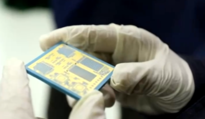

# 元宇宙之后NFT数字收藏品热度上升 互联网巨头加码布局

2021年以来，元宇宙之后最火的数字科技概念是什么?无疑是NFT(非同质化通证)，而且热度延续至今。1月23日，国内迎来了汽车行业NFT首拍，荣威汽车NFT数字艺术藏品以100万元价格被拍卖。此前，阿里、腾讯、京东、哔哩哔哩等一众互联网巨头也开始布局NFT，纷纷推出数字收藏品平台。

即将举行的冬奥会更是给NFT添了“一把火”，安踏、中体产业等企业接连推出冬奥数字藏品，甚至在A股市场掀起热潮，数字藏品概念股迎来一波涨幅。

值得注意的是，与国外将NFT作为代币进行金融化、炒作化相比，国内对待NFT的态度更为谨慎，主要聚焦NFT对于版权保护的功能作用。

同时，专家指出，国内NFT相关制度环节还需进一步打通，NFT虽然能给数字资产确权，但数字资产价值认定却是个问题，需要在立法上对数字资产知识产权进行立法。

**NFT市场超千亿规模**

NFT，非同质化通证(Non-Fungible Token)是一种架构在区块链技术上的，不可复制、篡改、分割的加密数字权益证明，其映射实体收藏品等实物资产和图像、音乐、游戏道具等虚拟资产。根据天风证券研报，NFT的核心价值在于“数字内容资产化”，依托区块链技术保证数字资产的唯一性、真实性和永久性，增强其流动性，并有效解决上链资产的确权问题，解决版权保护痛点。

易观分析师廖旭华表示，NFT的核心价值在于确权，也就是赋予数字产品唯一性，从而使得数字产品具备物理产品的同等消费和收藏价值，解决了数字产品的可复制性带来的价值限制。

据市场调查机构Chainalysis报告显示，2021年NFT市场规模已经至少达到269亿美元，约合人民币1700亿元。

互联网文化创意产业和NFT有着天然的接近性也促使许多头部互联网企业纷纷布局NFT。如阿里拍卖新增数字艺术品拍卖频道，支付宝推出数字藏品发布平台“鲸探”;腾讯推出了NFT交易软件“幻核APP”;京东发布了NFT发行平台“灵稀”;小红书也成立R-Space实验室，用于展示和发售数字藏品等。近日，B站正式入局NFT，公布首款数字艺术头像“鸽德”。

**B站数字艺术头像“鸽德”**

**阿里拍卖新增数字艺术品拍卖。**

与此同时，NFT新颖的概念更是吸引一众粉丝、参与者进行投资。1月12日，周杰伦名下潮牌PHANTACi首次限量发售NFT项目Phanta Bear，该NFT产品发行上限10000个，单价为0.26个ETH(约6200元)，总价超6200万元，1小时之内便销售一空。

此前不少NFT数字艺术藏品更是拍出高价。如加密艺术家Beeple《Everydays -The First 5000 Days》在佳士得拍卖行更是拍出了超6900万美元;而Twitter联合创始人将一条仅有5个单词的推特以NTF形式拍卖，最终成交价超过290万美元。

“由于之前虚拟货币也就是FT(同质化货币)炒作，很多人将NFT和FT等同，以为这是一种新炒作货币，其实并非如此”，工信部信息通信经济专家委员会委员、中南财经政法大学数字经济研究院执行院长盘和林表示，NFT是数字资产确权，其让数字资产具备了唯一性和稀缺性，但唯一性并非数字资产价值的来源，数字资产本身的价值才是。

“由于海外部分平台和部分产品的过度炒作，导致大量公众将NFT和炒作、币圈等关联起来”，廖旭华分析，整体而言，在国外市场，NFT的技术特性和交易功能，让其不可避免地成为虚拟货币炒作的新热点之一，其中很多买方来自虚拟货币市场，购买行为的目的性大于购买标的的价值本身。

**国内业界多聚焦数字藏品**

数字艺术品之外，游戏作为与NFT契合度最高的领域之一，许多游戏企业将NFT视为增长点。去年，Netmarble、Ncsoft、NHN、Kakao games等多家韩国游戏企业，都曾公开表示要进军NFT。

在国外，NFT游戏的“P2E”(边玩边赚)的特性让许多发展中国家趋之若鹜。据独立研究机构Finder出示的报告，人均收入越低的国家，NFT游戏普及率越高。菲律宾、泰国、马来西亚分别以32%、27%和24%的国民NFT资产持有率，名列世界前茅。

不过，游戏NFT功能金融化的趋势也引起了韩国政府的关注。去年7月，有接入NFT交易系统的游戏被韩国游戏管理委员会以游戏内包含NFT功能为由，拒绝进行审查和评级。去年11月，韩国监管机构宣布禁止使用NFT应用的游戏，并表示这些新服务可能会助长青少年的赌博风气，韩国游戏评级和管理部门的一位官员表示，“我们禁止的并不是区块链技术，而是可以与实物资产挂钩的非功能性NFT的应用。”

此外，也有许多游戏开发人员对游戏与NFT的结合持谨慎态度。GDC 游戏开发者大会公布的《2022 年游戏产业问卷调查报告》显示，70%的开发者对 NFT 丝毫不感兴趣，72% 的人也对加密货币作为支付工具不感兴趣。只有 1% 的开发者表示，他们的工作室已经在使用 NFT 或加密货币技术。

在报告中，甚至有游戏开发者认为，“NFT是一种还在寻找目标的技术。人们会对它感兴趣，把它作为一种赌博来赚钱，但公众对它的需求还不足以使其成为实际的货币。”

国内一众布局了NFT的互联网企业也显得尤为谨慎。如阿里的鲸探、腾讯的幻核等平台并未直接提及NFT，取而代之的是“数字藏品”，且都声明不鼓励任何形式的数字藏品炒作行为。同时，相关平台还对二级交易进行了限制，类似物品在私人区块链网络上交易，而非通常在以太坊(ETH)和其他众所周知的协议上交易。

“国内NFT市场相对理性，以收藏价值为主，并不允许交易和炒作，大家购买NFT的核心在于关注创作者创作的内容价值和对版权保护的认可”，廖旭华表示。

“国内NFT以数字藏品的名字出现，本身就是在监管的要求下，拒绝二次交易的一种定性。没有二次交易，也就很难被炒作成天价”，互联网行业分析师张书乐认为，国内NFT大多是以一种营销的衍生品出现，甚至于作为一些大厂的“礼品”进行赠送。

在去年10月，国家版权交易中心牵头发布了《数字文创行业自律公约》，对数字藏品提出了十一项共识。抵制炒作亦是《公约》的重要共识：坚决抵制任何形式的以数字文创作品为噱头，实质发行和炒作虚拟货币的行为;坚决抵制任何形式的数字文创作品价格恶意炒作，防范投机炒作和金融化风险。

**“馅饼”还是“陷阱”?**

“现阶段国内企业在NFT领域还处于试水阶段，并未想好‘怎么用’”，有业内人士向南都记者透露，NFT领域法规体系的空白，使得NFT鱼龙混杂。

如何区分“馅饼”还是“陷阱”?多数专业人士认为关注NFT作品的艺术价值、创新性等创作本质才是规避风险的最好办法。

张书乐分析到，无论是依托于实物还是数字化的NFT，其真正的价值都来自创作本身的艺术性或独特性，创意才是价值所在，而非所谓的唯一。基于这种定性，NFT不管表现形式是什么，其实都是收藏品范畴，用传统收藏品市场的模式去界定馅饼和陷阱，往往效果最佳。

“在没有专业的艺术鉴赏能力的情况下，不要关注那些本身内容简单却被强加象征或抽象意义的NFT”，廖旭华认为，“最重要的是不要以炒作获利为目的”。

与此同时，国内NFT相关制度环节还需进一步打通。盘和林表示，NFT虽然能给数字资产确权，但数字资产价值认定却是个问题，需要在立法上对数字资产知识产权进行立法。NFT虽然能够让数字资产具备唯一性但不能杜绝抄袭，如果有人通过NFT先手获得了某个数字艺术品的产权，则会侵害到原作者的利益。同时，也要看到NFT设立也存在成本，主要通过虚拟加密货币的方式，但国内对于加密货币是阻断其风险传导，而NFT容易因加密货币而进入波动期。

对此，盘和林建议，国内NFT交易当中，可以嵌入数字人民币，从而避免虚拟货币支付模式，国内数字人民币可以结合国内的区块链平台来推进NFT的发展。同时在立法上，要对数字资产进行产权确认。

值得注意的是，冬奥会成为数字人民币试点的“窗口”。1月4日，数字人民币(试点版)应用上架苹果AppStore与安卓各大应用商店。数字人民币面向深圳、苏州、雄安、成都、上海、海南、长沙、西安、青岛、大连以及冬奥会场景(北京、张家口)开展试点。据中国人民银行透露，在冬奥会北京赛区，数字人民币受理环境建设工作正加快推进。

此外，廖旭华还认为，国内NFT市场还需要补足两个短板：一是，平台需要保持克制，产业链各环节企业形成配合，以防止炒作投机的行为泛滥;二是，需要开发受众群体更加广泛的产品，让更多人了解NFT的价值，从而使更多的创作者受益，建立正向循环。
