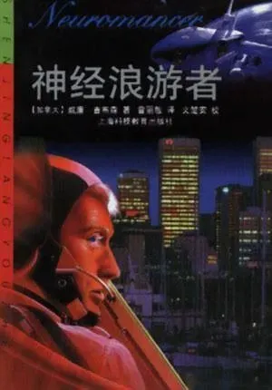

# 从赛博朋克到元宇宙：群体奴役与个体解放

“元宇宙”，这个来自科幻小说的自造词汇，不仅击穿了科技界、互联网圈与大众传媒之间的壁垒，而且将关于未来的幻想与焦虑，广泛地散布到了人文学者、政务部门人员以及最广大的网络用户当中。近半个世纪前赛博朋克所描绘的晦暗未来，正在加速弥散成一幅更加混沌的世界图景。“元宇宙”召唤着肉体与机器的深度结合，要求线下个体在网络中注册自己的赛博分身，并承诺一套全然自由和新创的社会乃至自然法则，这在过去的幻想和当下的事实中都有其对应。这一语境下，未来是现下在时间维度上的无限延伸，它的可能性早已内蕴在眼前世界的某个角落当中。技术权力的争夺轰轰烈烈，随之而来的奴役悄无声息，其中尚且蕴含着走向彼此共通之人类解放的惶惑与希望。

---

如同韩裔美籍学者朱瑞英在《隐喻会梦见语言之眠吗？》一书中所提及的，工业革命之后的所谓“现实主义”文学，实际上已经无法真正对现实图景进行表现（representation），而只能依赖于隐喻来提供某种并不精确的模仿。这并不意味着文学正在失去它直抵现实本质的力量，反而是凸显了人类在面对难以把握的科技经验之时所激发出的想象力量。毕竟物种意义上的人类的更新演化，需要数以十万年计的时间；而组成当下人类生存环境的新技术产品，往往是以季度和星期来排列迭代的次序。

“元宇宙”，以及这个概念的流转与发展历程，正是对当下人类所面对的共同困境的绝佳隐喻。我们用这个有着清晰词义错位的翻译，来指代以互联网为代表的信息技术发展所必然导向的下一个阶段。一方面，由于人们对“下一代互联网”有着千差万别的认知和描述，因而这个词被用来指代一系列差异颇大的未来图景；另一方面，“元”而且“宇宙”，这个词汇远较“Metaverse”响亮，二者之间的这种错位，又给中文语境下本土科技文化的生长提供了空间。

有趣的是，这个来自科幻小说的自造词汇，不仅击穿了科技界、互联网圈与大众传媒之间的壁垒，而且将关于未来的幻想与焦虑，广泛地散布到了人文学者、政务部门人员以及最广大的网络用户当中。这种只属于信息时代的传媒事件，正如位于概念核心的“虚拟现实技术”一样，在诸多层面上打破了人机界限，改变了物理空间与信息空间相互链接的基本方式。而这一切也预示着，近半个世纪前赛博朋克所描绘的晦暗未来，正在加速弥散成一幅更加混沌的世界图景。

赛博朋克叙事的幼稚之处，在于它虽然意识到了技术资本所必然带来的全方位压迫，却仍旧寄希望于一个依托于个人原生性的天才，以及个体所能掌握的科技资源，来形成一个反抗性的——或至少标榜着不合作性质的——乌托邦。在从《神经浪游者》到《雪崩》的赛博空间图景中，线下生活的平庸与困顿是线上个体全面解放与全面超越的充分必要条件。这种前互联网时代的幼稚幻想，实质上仍旧是在以个人英雄气概来抗拒——甚至不是反抗，更毋庸说革命——“终结历史”的晚期资本主义。因此，现实中这场文艺运动的繁荣兴起到迅速凋零，恰好与其文本中所浸润的绝望抗拒形成了微妙的互文。其后无论是将菲利普·迪克的疯癫追认为赛博朋克先驱，还是在《攻壳机动队》或《铳梦》之类灌注着昭和残响的异域风情中寻找文化支脉，都难以承续那些尚未逝去的先辈在青年时代的热情、真诚与痛苦。

**《攻壳机动队》海报**

这些来自文艺虚构的无奈与绝望，随着现实网络空间以及赛博文化的发展，影响着当下具备更深刻不确定性的“元宇宙”叙事。在对这个来自上个世纪以及上个时代的词汇进行概念考古和思潮定位的过程中，我们猛然意识到，现实历史中信息技术对人类文化生活的全方位入侵，甚至比对肉体躯干的渗透来得更快。

具体来说，“元宇宙”召唤着肉体与机器的深度结合，要求线下个体在网络中注册自己的赛博分身，并承诺一套全然自由和新创的社会乃至自然法则，这在过去的幻想和当下的事实中都有其对应。

首先，物理意义上通过肢体改造或信息设备植入而形成的“赛博格”（Cyborg）还是罕见的个例，但信息通信网络已经被视作人类文明基础设施建设——社群或社会组织和治理，冷热战争对抗，乃至国家和文明竞争与共存——的组成部分。其次，虽然眼下意识上传或辅助思考的“湿件”，基本还停留在小说和思想实验之中，但对人类有限的注意力时间和生产消费及传播场景的争夺，已经吸引了海量的计算力。我们不断看见鲜活的个体被桎梏在算法所带来的推送与派遣当中，也不自觉地将自己的部分情绪和人格以模块化的方式放置在不同的互联网巨头所提供的“空间”与“平台”之上。最后，尚值得庆幸和期待的，是伴随着诸多话语权力斗争和技术管理的摸索，全新的文化公共空间正在形成，全新的议事规则和信息传播逻辑也正在演化。当然，这种不断变动的发展变化，恰如生命与环境在数十亿年间的磨合与选择一样，迫使每个个体和社群都独立地进行学习、适应，或者付出代价，或者成为代价。

小说与现实，哪个更令人气闷呢？赛博朋克小说中的主人公，虽然拥有“高技术”，却仍旧过着“低生活”，他们的科技和资源无法革新、引领抑或影响资本和市场的逻辑，只好掩藏自己的真名实姓以求有限的自由。在现实中，从中本聪到斯诺登，从海盗湾到Sci-Hub，“大巫师”们的传奇固然还在延续，但他们无不托庇于机器与机器、企业与企业之间的罅隙。在可以预先设想到的层面，文本内外、线上线下似乎打了个平手；但在科幻作家孱弱的想象力之外，更晦暗的事情正在发生。相比之下，马斯克、扎克伯格这些“外星资本家”们拥有强大得多的技术储备、计算能力、政府扶持和舆论支撑。掌握了“高技术”的他们，也过着“高生活”。当“元宇宙”被推动、推广和推进的时候，他们不是反抗大机器的螺丝钉，也不是从主流市场中自我放逐的赛博朋克，而是在迷幻药和电子迷幻药之间预售着人类的未来演化方向。他们是“把海弄干的鱼”。

我们知道，未来是现下在时间维度上的无限延伸，它的可能性早已内蕴在眼前世界的某个角落当中。技术权力的争夺轰轰烈烈，随之而来的奴役悄无声息，其中尚且蕴含着走向彼此共通之人类解放的惶惑与希望。因此，这篇文章合适的标题可能是“个体解放@群体奴役”。就如同电子信箱中的“@”，“@”后面的符号代表的是提供（电子邮件）服务的服务商。“元宇宙”技术和场景，主要是由这些大资本或者商人提供/垄断。“元宇宙”中的个体解放，也是建立在“外星资本家”们所提供的基础服务或者描绘的图景之上的，即“在群体奴役中寻找个体解放”。
