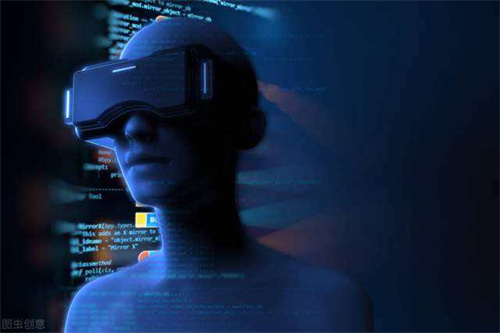

# 超图软件中标元宇宙项目，建设数字孪生机场

近日，超图软件（证券代码300036）在投资者关系调研活动中表示，公司今年中标了首个元宇宙项目，即福厦机场VR沉浸式体验系统采购实施项目(下称“福厦机场VR项目”)，据悉，该项目中标金额约400万元。

据介绍，福厦机场VR项目是以BIM+GIS+VR为核心技术的沉浸式体验系统，将厦门新机场航站楼室内区域、全场红线范围内室外区域（含建筑物、飞行区）和福州长乐机场T2航站楼室内区域、全场红线范围内室外区域（含建筑物、飞行区），基于航站楼BIM模型数据、航站楼室内装修效果图/设计图/宣传视频和室外GIS数据进行三维仿真和最大程度的场景效果还原搭建。

与此同时，公司将为福厦机场VR项目开发沉浸式体验系统，提供场景编辑和浏览漫游功能，实现VR端720度自由漫游和PC端模拟巡游及高清展示功能。

总结来说，福厦机场VR项目是搭建一个“数字孪生机场”。这意味着，虽然该新机场还没有建成，在建成之前我们就可以看到建成之后的样子，如空间布局、管道等，还可以通过VR进入到新机场之中，切实感受一个新机场，即进行真实体验，看看是否合适，哪些是否需要微调等等。

**机场运营的智慧化**

自疫情暴发以来，全球民航业步入寒冬。今年1月12日，国际民航组织（ICAO）发布的报告称，与2019年（疫情之前）相比，2021年全球旅客运输总量下降了49%，2020年全球旅客运输总量比2019年下降了60%。预计2022年全球旅客运输总量将比2019年下降26%至30%。

在严峻的形势下，综合运用数字孪生、大数据、云计算、人工智能等科技手段，提升机场作为航运枢纽的运行管理效率，是当务之急。

今年1月，民航局印发《中国民航四型机场建设行动纲要(2020-2035年)》，提出了“平安、绿色、智慧、人文”四型机场的建设要求，同时指出要“利用智慧化的措施和手段来实现”。

目前，民航局已经确定了“首都机场智慧机场建设项目”“北京大兴机场智慧机场建设项目”、“广州白云机场智慧机场建设项目”、“深圳机场未来机场建设项目”等23个标杆示范项目。

**数字孪生机场**

首先，机场作为航空转运枢纽，需要对飞机状态、远近空域、地上地下、公交客流等情况了如指掌，涉及到的系统纷繁复杂：如场面监视雷达、机坪全景监控系统、机场系统决策系统(A-CDM)、航延信息发布系统、空管协同系统、气象观测系统、航站楼楼宇管理系统(IBMS)等，系统集成难度非常大。

其次，从场景侧看机场业务，可以大致分为航空侧、航站侧、地勤侧，而实际管理中则涉及机场运营指挥中心(AOC)、航站楼运营指挥中心(TOC)、机场地面交通中心(GTC)、当地市政部门(如轨道交通、卫生防疫部门)、公安系统等多部门协同。但这些部门间的数据往往是缺乏互通，造成了机场管理中的一个个数据孤岛。

最后，传统机场管理系统本身，也存在数据空间属性欠缺、场景割裂、交互界面不直观等挑战。

这些问题都需要在新型机场指挥系统中得到解决。

数字孪生是通过利用物理建模、传感器数据、历史运行数据等多种数据源，集成多学科、多物理量、多概率计算的仿真过程，实现在虚拟空间中对现实设备、系统的映射，从而可以在虚拟空间模拟实体装备的全生命周期过程，其本质是创造一个数字版的现实装备“克隆体”，也称为“数字孪生体”。

机场一旦拥有了数字孪生的能力，就可以提升数据分析、业务管理的效率，为机场管理中的各类难题，提供直观、可视化的解决路径，使机场管理方享受数字孪生带来的技术红利。

**GIS是元宇宙的技术底座**

超图软件成立于1997年，2009年于深交所创业板上市，现已发展成为全球第三大、亚洲第一大GIS（地理信息系统）软件厂商。超图软件的三维GIS技术的应用领域十分广泛。

元宇宙的重要内涵之一，是通过AI、VR、数字孪生等技术，把物理世界镜像映射到虚拟世界。

公司认为，GIS是元宇宙的技术底座，其中很多技术都赋能元宇宙。三维GIS的作用在于，把物理世界大量的多源异构数据（例如城市、建筑、自然资源等数据）的三维镜像映射到虚拟世界。

目前，三维GIS模拟现实的模式，已经被广泛应用于城市管理等领域。以超图软件的明珠湾智慧城市信息平台为例，在GIS技术的基础上，整合BIM技术实现实体明珠湾向数字明珠湾的实体映射，最终形成动态可视化城市空间模型，指导实体规划建设和运营。

公司称，公司的BIM+GIS的融合应用在不断深入，在智慧城市领域，比如数字孪生机场、场站管理、高铁站、智慧园区、智慧建筑管理等业务增长较为明显，公司认为这一块有很大的市场潜力。

此外，超图软件表示，公司在元宇宙领域有相应的产品规划、应用场景规划，这将支撑或支持公司的元宇宙项目产品和工具研发，今年会陆续发布一些产品。
