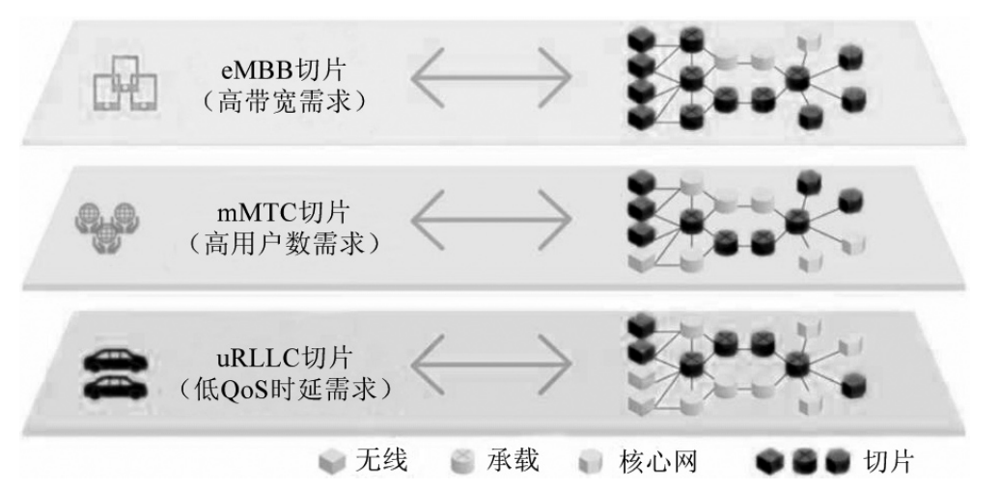
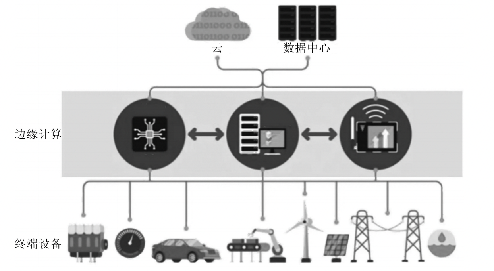

# 认识元宇宙技术的一个框架

元宇宙是人们的想象与现实技术条件之间的耦合，在不同的技术条件下，元宇宙的形态和实现方式都会不一样。这意味着，要想了解元宇宙发展的现状、洞悉元宇宙未来可能发展的方向，就必须对与之相关的技术有一定的认识。

与元宇宙相关的技术可谓错综复杂。我们可以看到各种各样科技感十足的名词——VR、AR、人工智能、区块链、物联网……似乎所有酷炫、充满科技感的词汇都能和元宇宙找到交集。各种科技词汇都和元宇宙扯上关联也并非哗众取宠，因为从技术角度看，元宇宙确实关联甚广，很多技术的变化都会对元宇宙的建设产生影响。

由于与元宇宙相关的技术过于纷繁复杂，因此出于讨论方便的考虑，我们将其中的关键技术分为了八大类：

（1）区块链技术（Blockchain）；

（2）交互技术（Interactivity）；

（3）通信技术（Communication Technology，5G、6G）；

（4）云和边缘计算（Cloud and Edge Computing）；

（5）高性能计算和量子计算（High-Performance Computing and Quantum Computing）；

（6）物联网和机器人技术（IoT and Robotics）；

（7）网络技术（Network）；

（8）人工智能技术（Artificial Intelligence）；

由于这八类技术的首字母的缩写正好为BIGCHINA，因此我们将其称为支撑元宇宙发展的“BIGCHINA技术体系”或者“大中国体系”。下面，我们将逐一对这八类技术的基本状况进行介绍。当然，介绍的顺序将根据各种技术和元宇宙的关联状况进行调整，而不会按照“BIGCHINA”的字序。

### **交互技术**

从技术上看，元宇宙是由计算机生成的，因此人们要进入元宇宙，计算机就是必要的途径，而一个人在元宇宙内的所有行为，也都是通过计算机实现的。因此，在考虑元宇宙问题时，人机交互就成为首要的问题。

虽然计算机是人们发明的工具，但自它被发明以来，却一直在某种意义上扮演着“主体”的作用。换言之，“人要围着机器转”，人们要根据机器的特征去调整与它的交互方式。在这种条件下，人的创造性和能动性就是被束缚的。因此，实现人机交互的根本变革，实现从“机器是主体”到“人是主体”的转变就十分重要了。元宇宙的一个重要意义，就是要把人们从过去通过文字、代码等方式进行人机交流的情境中解脱出来，转而在一个虚拟环境下，用更为自然的方式来达

成人机交互。而要做到这一点，就需要有多种技术进行支撑。

与元宇宙相关的人机交互技术主要有三类：虚拟现实（Virtual Reality，简称VR）、增强现实（Augmented Reality，简称AR），以及混合现实（Mixed Reality，简称MR）。在一些文献中，有时也会把这三类技术统称为扩展现实（Extended Reality，简称XR）。

VR 设备中看到的视差

所谓VR，指的是用机器模拟出一个虚拟的场景，让人们可以产生身临其境的感受。如果说VR的目标是用计算机凭空模拟出一个虚拟的世界，那么AR的目标则是要将图形、声音、触觉等要素添加到现实世界中；MR则是把AR和VR相结合，彻底达到虚实结合、虚实交互的境地。

严格地来说，AR和MR是有区别的，有两个标准来对它们进行区分：一是虚拟物体的相对位置是不是会随着设备的移动而移动；二是在理想条件下，虚拟物体和现实物体是不是可分。如果虚拟位置的相对位置不会随着设备变化，并且虚拟和现实是可分的，那么它就是AR；反之，如果虚拟位置的相对位置会随着设备变动，并且虚实之间已经融为一体，那么它就是MR。当然，在实践当中，人们经常会混用这两个词，很多本应该被称为MR的产品，都被称为了AR。

### **人工智能**

如果说，以VR、AR为代表的交互技术是人们进入元宇宙的门户，那么人工智能技术就是让整个虚拟世界能够和人互动起来的发动机。

我们将“人工智能”理解为让智能体（agent）在复杂条件下达成目标的能力。从历史上看，人们尝试过很多方法来实现人工智能。例如，早期人们曾经尝试从神经科学入手，模拟人脑的运作来达成人工智能。而在最近，机器学习（machine learning）已经成为人工智能的主流方法。

所谓机器学习，就是通过对大量数据的分析，让计算机在没有预先进行明确编程的前提下拥有学习的能力，找到处理问题的方法。比如，如果我们想训练计算机具有识别出图片中的猫的能力，就可以找来一堆动物图片“喂”给机器，让它“学习”。

当然，“学习”的方法可以有很多种。传统上，我们会更多采用一种被称为监督式学习的方法：把那些有猫的图片找出来，然后对猫的特征进行标识，比如，有大眼睛、圆脸、胖爪子等……等计算机学习了大量的图片后，就会知道具有这些特征的动物就叫做猫。

不过，这种训练的方式显然十分费时费力，仅仅对数据标识就要花费大量的人力物力。因此，现在一种被称为“深度学习”（deep learning）的无监督学习方法就变得更为流行了。

所谓深度学习，是一种模仿人脑思维过程的方法，它利用多层神经网络进行学习，通过组合低层特征形成更加抽象的高层表示属性类别或特征，最后作出综合判断。回想一下我们学会认识猫的过程，并没有人找很多猫来进行标注，让我们学习，我们只是看多了，就自然而然地知道什么是猫了。把这个“自然而然”的过程进行解剖，我们其实是通过对猫的大量观测，在大脑中总结出了很多关于猫的特征，然后把这些特征结合起来，就能判断看到的动物是不是猫。类似地，深度学习也是通过对大量样本的学习，逐步总结出一些判断动物是不是猫的总要特征，然后根据这些特征来进行判断。

用深度学习教计算机识别一只猫

在大数据条件下，相比于传统的机器学习，这种学习方法的效率优势十分明显，在识别物体方面，它基本上可以达到和人工识别一样的精确度。不过，有利必有弊。在可解释性上，深度学习却具有明显的短板——我们虽然知道计算机能从图中识别出一只猫，但却很难知道它是凭借什么标准来实现这一点的。

**在现阶段，人工智能在元宇宙的应用主要有三个方面：实时场景和数字孪生体制造、虚拟人的智能化，以及数字化身的个性化。**

在元宇宙中，用户的位置会是随时变换的。与之对应的，虚拟场景也就要随之变换，以保证其与用户的互动。在这个过程中，大量的图形、阴影变化，都需要人工智能来实时作出判断。

所谓数字孪生，是对物理实体或系统具有高度完整性，并可以与物理世界保持交互作用的数字克隆体，它们可以在元宇宙里用来对物理实体进行实时处理。

在元宇宙中，除了人的数字化身之外，还会有很多作为“气氛组”存在的虚拟人NPC。就像在电影《失控玩家》里一样，这些NPC需要有一定和人进行交互的能力，以满足人们与之进行互动的需要。而要实现这些NPC的智能化，就需要应用人工智能技术。

为了大幅提升虚拟人NPC的训练效果，经常会用到强化学习。这种学习方法让智能体在复杂的环境中不断试错，并根据返回结果的正误来给予“奖励”或“处罚”，借助这种思路，就可以在很短时间内让它们的AI水平有很大的提升。现在，强化学习已经被广泛运用于电脑游戏，相信在未来的元宇宙当中，这种学习方法也会得到比较多的应用。

在元宇宙中，每一个用户都需要通过一个化身来行走江湖。因而，为了创建更逼真的虚拟环境，丰富的化身表示是必要的。但是，在很多元宇宙项目中，创作者只提供少数几个特定的模型或只允许玩家创建只有几个可选子模型的完整化身，如鼻子、眼睛、嘴巴等。因此，玩家的化身形象高度雷同，这在很大程度上损害了元宇宙本身的乐趣。

### **高性能计算和量子计算**

正当全世界都在对元宇宙表现出无限的憧憬时，英特尔公司却跑出来给“元宇宙热”泼了一盆冷水。不久前，美国科技媒体网站The Verge发表了一篇文章，文中援引了英特尔高级副总裁兼加速计算系统和图形部门负责人拉贾·科杜里（Raja Koduri）对元宇宙的一段评论。科杜里认为：“元宇宙可能是继互联网和移动互联网之后的下一个主要计算平台。但是，我们今天的计算、存储和网络基础设施还根本不足以实现这一愿景。”需要指出的是，科杜里对于算力的条件尤其表示担忧，他说：“实现元宇宙所需要的算力将会是现在全部算力的一千倍。”如果科杜里的判断是正确的，那么算力的制约就会成为进入元宇宙的最大障碍。想要真正拥抱元宇宙，就必须努力突破这一瓶颈。

从目前看，突破算力瓶颈有着多种可能的技术路径。包括高性能计算、量子计算、神经形态计算、概率计算等。限于篇幅，这里将主要介绍高性能计算和量子计算。

所谓高性能计算，通俗来说，指的就是利用聚集起来的计算能力来处理标准工作站无法完成的数据密集型计算任务。作为一个综合的领域，高性能计算涉及的问题十分复杂，包括软件、硬件等各个层面。

高性能计算中，最为重要的核心技术是并行计算（Parallel Computing）。所谓并行计算，是相对于串行计算而言的。在串行计算当中，计算任务不会被拆分，一个任务的执行会固定占有一块计算资源。而在并行计算中，任务则会被分解并交给多个计算资源进行处理。

当然，这种任务的分解和分配可以是多样的，可以是把计算任务分给多个处理器，让它们协同求解，也可以是被求解的问题分解成若干个部分，各部分均由一个独立的处理机来并行计算。并行计算系统既可以是含有多个处理器的超级计算机，也可以是以某种方式互连的若干台独立计算机构成的集群。

从架构上看，并行计算可以分为同构并行计算（homogeneous parallel computing）和异构并行计算（heterogeneous parallel computing）。顾名思义，同构并行计算是把计算任务分配给一系列相同的计算单元；异构并行计算则是把计算任务分配给不同制程架构、不同指令集、不同功能的计算单元。比如，多核CPU的并行运算就属于同构并行，而CPU+GPU的架构就属于异构并行。

对比于同构并行，异构并行具有很多的优势。用通俗的语言解释，这种优势来自各种计算单元之间的“术业专攻”，在异构架构之下，不同计算单元之间的优势可以得到更好的互补。正是由于这个原因，异构并行计算正得到越来越多的重视。尤其需要说明的是，在元宇宙领域，很多大型企业给出的计算解决方案都是基于异构并行的。

如果说高性能计算是在运算资源的分配上下功夫，那么量子计算就是试图通过改变经典计算的整个逻辑来提升运算效率了。

我们知道，经典计算的基本单位是比特，比特的状态要么是0，要么是1，因此经典计算机中的所有问题都可以分解为对0和1的操作。而量子计算的基本单位则是量子比特，它的状态则可以是一个向量。这样一来，量子存储器就比经典的存储器具有很大的优势。

打个不太恰当的比方：玩过动作游戏的朋友大多知道，在游戏中，我们扮演的英雄经常可以使用很多招数，有些招数只能是针对单一对象输出的；而另一些招数则可以针对全体敌人输出。这里，前一类的单体输出招数就相当于经典计算，而后一类的群体输出招数就相当于量子计算。我们知道，在面对大量小怪围攻的时候，一次群体输出产生的效果可以顶得上很多次单体输出的招数。同样的道理，在一些特定情况下，量子计算可以比经典计算实现非常大的效率提升。

举例来说，大数因式分解在破解公开密钥加密的过程中有十分重要的价值。如果用计算机，采用现在常用的Shor算法来对数N进行因式分解，则其运算的时间将会随着N对应的二进制数的长度呈现指数级增长。1994年时，曾有人组织全球的1 600个工作站对一个二进制长度为129的数字进行了因式分解。这项工作足足用了8个月才完成。而从理论上看，如果我们要分解一个二进制长度为1 000的数，将会耗时1025年——真不知道到时候银河系还在不在！然而，如果同样的问题换成用量子计算来解决，那么整个问题就可以在1秒之内解决。量子计算的威力由此可见一斑。

但是，在看到量子计算威力的同时，我们也必须认识到，至少到目前为止，量子计算的威力还只能体现对少数几种特殊问题的处理上，其通用性还比较弱。事实上，现在见诸报道的各种量子计算机，也都只能执行专门算法，而不能执行通用计算。比如，谷歌和NASA联合开发的D-Wave就只能执行量子退火（Quantum Annealing）算法，而我国研发的光量子计算机“九章”则是专门被用来研究“高斯玻色取样”问题的。尽管它们在各自的专业领域表现都十分优异，但都还不能用来解决通用问题。这就好像游戏中的群体攻击大招，虽然攻击范围广，但是对每个个体的杀伤力都比较弱。因此，如果遇上大群的小怪，群体攻击固然厉害，但如果遇上防御高、血条厚的Boss，这种攻击就派不上用处了。

从这个角度看，如果我们希望在元宇宙当中用上量子计算的威力，就必须先找出适合量子计算应用的问题和场景，然后再找到相应的算法。与此同时，我们也必须认识到，虽然量子计算的研发和探索十分重要，但是它和对其他技术路径的探索之间更应该是互补，而不是替代的关系。

### **云计算和边缘计算**

如果高性能计算和量子计算都不能完全回应元宇宙带来的算力挑战，那么还有一种可能的解决思路就是应用云计算。

我们可以用一个通俗的比喻来对云计算进行理解。在传统上，用户主要是通过调用自有的单一IT资源，这就好比每家每户自己发电供自己用；而云计算则好像是建了一个大型的发电站，然后将“电力”（IT资源）输出给所有的用户来用。

用户就可以根据自己的需要来选择相应的IT资源了。比如，如果元宇宙的用户需要更多的算力或存储，而本地的机器无法满足，那么就可以通过从云端来获取“外援”。一个云端CPU不够，那就再来几个，按需取用，丰俭由人，既方便，又不至于产生浪费。

尽管从理论上看，云计算可以很好地承担元宇宙产生的巨大运算和存储需求，但是其缺陷也是很明显的。比较重要的一点是，在执行云计算时，有大量的数据要在本地和云端之间进行交换，这可能会造成明显的延迟。尤其是数据吞吐量过大时，这种延迟就更加严重。对于元宇宙的用户来说，这可能会对其使用体验产生非常负面的效果。

那么怎么才能克服这个问题呢？一个直观的思路就是，在靠近用户或设备一侧安放一个能够进行计算、存储和传输的平台。这个平台一方面可以在终端和云端之间承担起一个中介的作用，另一方面则可以对终端的各种要求作出实时的回应。这个思想，就是所谓边缘计算。由于边缘平台靠近用户，因而其与用户的数据交换就要更加及时，延迟问题就可以得到比较好的破解。研究表明，借助边缘计算，延迟可以降低60%以上。

边缘计算示意

当然，边缘计算的好处还不止于此。比如，边缘计算的应用还可以更好地保护用户的隐私。相比于传统的互联网，元宇宙将收集比以往任何时候都多的用户数据，其产生的隐私风险也将比以往任何时候都更为严重。现在的云服务大多是被一些互联网巨头掌握的，这些巨头在搜集用户信息方面可谓是不遗余力。这意味着，用户在畅游元宇宙的同时，自己的所有数据、行动轨迹，甚至生物信息都在时时刻刻遭到巨头们的窥视。

相比之下，边缘计算允许在边缘设备上处理和存储数据，就可以给用户隐私提供更好的保护。一方面，边缘服务不仅可以在授权过程中从应用程序中删除高度私密的数据，以保护用户隐私。另一方面，边缘平台还可以更方便地使用“联邦学习”（Federated Learning）等可以保护用户隐私的算法。这里说到的联邦学习，是一种区别于传统的集中化学习的机器学习算法。它不需要预先采集用

户数据，进行汇总之后再进行分析，而是可以把程序派到本地，直接返回学习的结果。最后，分析者只需要将这些返回的结果汇总，就可以得到最终的分析结论。很显然，在采用这样的算法之后，机器学习就能够不再和隐私发生冲突了。

### **通信技术**

元宇宙的使用会产生巨大的数据吞吐，而与此同时，人们对VR和AR的普遍使用则会要求更低的延迟。为了同时满足高吞吐和低延时的要求，就必须使用更高性能的通信技术。

按照通信所需要借助的介质差异，通信可以分为有线通信和无线通信。总体来讲，有线通信的速度要远远高于无线通信。在2021年7月，日本已经将有线通信的记录刷新到了319 Tbps，也就是说每秒可以传输的数据量已经达到了39.9 TBytes。按照这种速度，传输一部10 G的高清电影只需要0.0003秒。应该说，以这个传输速度，已经完全可以满足元宇宙的需要了。

但问题是，人们希望能在元宇宙当中自由地活动，而不愿意被束缚在计算机或者某个固定的设备旁边。这样一来，元宇宙的通信就会更多依赖于无线通信。

在无线通信中，光波是最主要的载体。光波的传播速度主要是由其带宽决定的，而带宽的大小则取决于其波动频率。因此，无线通信技术从1G发展到5G，就是在不断增加光波的波动频率，借以提升其带宽。

或许有人认为，既然如此，那问题不就简单了？只要不断努力提升光的波动频率，不就可以让无线传输的速度无限提升了吗？但问题显然没有这么简单。原因在于，光的波动频率和波长的乘积是一个定值，也就是光速。因此，波动频率越快，对应的波长就越短。而波长一旦短了，就会出现很多问题。例如，它的覆盖率会很短、穿越障碍的能力会很差。

那么，这些问题应该如何解决呢？现在的5G技术对此提出的解决方案是建造更为密集的微基站。不就是信号覆盖小、穿越性差吗？那我把周围都建上基站。当然，这样的基站不能建得很大，只能微型化。幸好，由于无线通信的电线长度需要和波长匹配，因此对于这些波长很短的信号，用的也正是很短的天线。并且，由于每一根天线都很短小，因此每个基站上都可以放上很多天线发送，很多天线接收。这种设计，就是MIMO，也就是所谓“多入多出”（Multiple-Input Multiple-Output）。

现在，5G技术已经逐渐开始普及。不过，即使如此，5G的传输速度依然难以和有线传输相比肩。如果与前面说到的有线传输极限速度相比，5G的传输速度大致上只有其1/16 000。不仅如此，由于5G需要建立大量的基站，因此其成本将是十分高昂的。因此在实践当中，只有一些人口密集的大城市有条件普及5G，而对于一些比较偏远的地区，5G则很难有机会得到应用。基于以上原因，我们认为，如果仅仅依靠现在的5G技术，恐怕还很难有效满足元宇宙提出的通信要求。6G以及更新的无线通信方案必须被引入。

### **网络技术**

除了通信技术之外，元宇宙对于网络的设计也提出了很多新的要求。

让我们想象一下这样一个场景：有A、B两个城市，本来彼此之间交流并不频繁。但突然有一天，B城市的居民突然迷上了A城市出产的水果，这样一来，两个城市之间的货运需求就陡然增加了几十倍。我们知道，水果是不能旧存的，所以从A城市到B城市的货运必须既要运得多，又要运得快。这个情况就是从传统互联网转向元宇宙时的写照。在元宇宙条件下，内容传输的量会比现在暴涨几十甚至上百倍，但对于延迟的忍耐力却更低了。

那么，如何才能满足这种高吞吐、低延时的挑战呢？我们不妨还是先看一看城市货运的那个场景。很显然，为了满足货运增加的需要，我们的第一反应就是准备数量更多的、速度更快的车——这就好像我们在考虑传输时，先要想从通信技术层面找到突破一样。但是，对于货运来讲，只增加车显然是不够的。如果不对道路进行相应的规划、管制和改建，那么这些飞奔的货车就会撞在一起，造成一片混乱。同样的，如果不对网络加以相应的设计，那么仅靠通信能力的提升也无法很好适应元宇宙的挑战。

面对拥堵的交通局面，一般来说，我们会采用宏微观两个层面的方法来对交通进行疏导。在宏观层面，我们会把道路进行分类，让不同的车走不同的道。类似警车、救护车、消防车等有紧急任务的车，会给出专道通行，而一般的私家车则会安排另外的通道。在微观层面，我们会在各个路口安排交警进行协调。一些人如果有急事，交警就会让他先行通过，而对于其他的司机，则需要进行更多的等待。在网络设计上，类似的思路依然有用。

交通上的分道行驶，在网络设计上被称为“网络切片”。简而言之，它就是把一个整体的网络切分成几个层，让不同的应用在不同的层次进行传输。这样，就可以在总传输能力有限的情况下，优先保证那些对网络要求较高的需求。可以想见，当元宇宙的需求被真正激活后，传输总量、传输种类都会出现暴增。在这种情况下，要对网络的资源进行更好地宏观配置，势必要对网络进行更为科学、精细的切片。

5G的网络切片示意图

交警对于道路的微观疏导对应到网络领域，就是所谓服务质量（Quality of Service，QoS）管理。我们知道，当道路通过量有限时，就必须决定谁先行、谁等待。类似的，当网络传输拥堵时，就必定会发生数据包的丢失。这时到底丢谁的数据包，就成了一个问题。QoS管理的逻辑就是按照服务对传输质量的要求来决定优先级，先丢弃那些对于传输要求不高的服务的数据，以尽可能保住那些对传输要求高的服务的数据。而究竟哪些服务对于传输的要求更高，依靠的主要是一套技术上的客观标准。

这个逻辑本身没有问题。但是，在元宇宙条件下，人的主观体验可能会越来越重要，因此有一些学者认为，应该用基于体验质量（Quality of Experience，QoE）管理取代QoS管理，来作为划定传输的优先级的标准。举例来说，如果从纯技术的角度看，对一个机器指令的传输可能要比一个游戏信号的传输更为重要，因此基于QoS的标准，应该先让对机器的指令通过。但对于用户来讲，这可能并不正确。事实上，对于很多人来讲，一个机器早执行、晚执行一个任务几分钟，并没有什么问题，而如果一个游戏的信号晚了几个毫秒，他的体验就会大幅下降。因此基于QoE的思路，应该先让游戏信号通过。

当然，元宇宙的应用场景很多，既有生活场景，也有工作场景。可以想象，QoS和QoE管理都会有其市场。至于如何根据场景的变化，随时切换两种管理模式，这或许会成为元宇宙条件下网络设计需要考虑的一个重要问题。

### **区块链技术**

在元宇宙当中，区块链是一种十分重要的技术。我们已经看到，包括Sandbox、Decentraland、Axie Infinity在内的众多元宇宙项目都采用区块链来作为它们的经济和治理系统的技术基础。

严格地说，区块链（Blockchain）并不是一种单一的技术，而是由多种技术组成的集合体，它的思想可以追溯到“中本聪”（Satoshi Nakamoto）于2008年发表的奠基性论文。最初，“区块链”只是用来描述比特币支撑技术的一种比喻说法，后来随着比特币架构体系的逐渐流行，这个名称才约定俗成，逐渐流传了开来。现在，区块链通常被用来指一种去中心化的基础架构和计算范式。它利用加密链式区块结构来验证与存储数据、利用分布式节点共识算法来生成和更新数据、利用自动化脚本代码（智能合约）来对数据进行编程和操作。

在整合了链式结构、分布式共识算法，以及智能合约的优点之后，区块链就成为一套非常强大的工具。从性质上看，区块链的运作并不依赖于一个中心化的协调者，可以实现人与人之间的点对点交互，可以在人们之间互不相熟的条件下保证交互的安全，还可以尽可能保证用户的隐私和数据安全。所有的这些性质，都使得它非常适合元宇宙中“人与人的自由联合”的组织方式。

### **物联网和机器人技术**

现在我们讨论元宇宙，大多是将其视为一个与现实世界相对的虚拟世界来看待的。无论是前面讨论的AR、VR，还是人工智能，都是围绕着这个虚拟世界在讨论。然而，这种虚实之间的分离叙事显然是不能让我们满意的。

试想，如果我们在元宇宙当中观看一档美食节目，视觉VR技术已经可以将食物及其烹调过程模拟得如真实一样。如果我们愿意，还可以借助嗅觉VR技术，模拟出这道美食的气味。好了，现在气氛都做足了，我们的馋虫都被钓到嗓子眼了。但是，这美食到底是假的，我们怎么馋，都只能馋了个寂寞。那么，怎么才能弥补这种遗憾呢？这时候，物联网、机器人等技术就能派上用处了。

所谓物联网，顾名思义，就是物的互联网。它可以通过各种信息传感器、射频识别等装置与技术，实时采集关于物体的各种信息，并通过各类可能的网络接入，达成物与物、人与物的互联，实现对物品和过程的识别和管理。对于物联网来说，有几项重要的支柱技术：一是射频识别（Radio Frequency Identification），也就是所谓RFID技术。它可以通过射频信号来对物体实现无接触的识别和信息采集。二是传感器。它可以自动、实时地对物体的相关信息进行提取。三是嵌入式系统。它可以嵌入到受控物体的内部，让物品在接收到相关指令之后，采取对应的行动。这几样技术，再加上通信网络、云等基础设施，就可以在人与人互联的基础之上，进一步实现万物互联。

如果物联网得到了充分的普及，那么当我们在元宇宙里看到了想吃的美食之后，就可以通过物联网将烹调相应美食的指令发送到附近的机器人那里。机器人可以根据程序，作出对应的美食，再送到我们的身边。如果能够达成这样的虚实互动，那么元宇宙对我们来讲就不再是一个虚拟世界，而成了我们生活的现实世界的一部分了。

需要指出的是，除了这种对未来的想象之外，元宇宙与物联网、机器人之间的互动事实上已经有了很多的现实应用。举例来说，在工业企业当中，有一些大型设备（如机械臂）由于其形状限制，对其操作十分困难。在这种情况下，如果可以利用AR，再加上物联网，就可以更好地完成对其的操控。

### **结语**

在每一个时代，人们都有着对元宇宙的想象和实践，但每一个时代关于元宇宙的想象和实践又各不相同。在这种差异的背后，是技术条件的差异。在任何时候，人们只可能用已有的技术条件去创造元宇宙，技术是什么样，相关的实践只能在它给出的约束下去进行。从这个意义上讲，认识当前与元宇宙相关的各类技术的现状和趋势，对于我们判断元宇宙的发展方向将是至关重要的。
